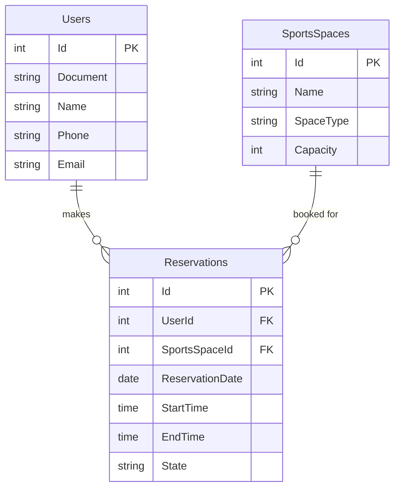
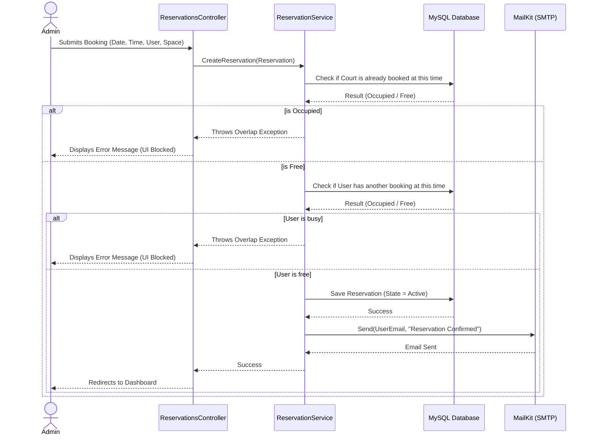

# 🏆 Nexus Sports Manager - Sports Complex System


Welcome to **Nexus Sports Manager**, a complete web application built with **ASP.NET Core 8 MVC**. This system was designed to handle the daily operations of a modern sports complex, allowing administrators to easily manage users, sports spaces (like soccer or basketball courts), and reservations, while ensuring no double-bookings ever happen.

---

## 👤 Student Information
* **Name:** [WRITE YOUR NAME HERE]
* **Student ID / Code:** [WRITE YOUR ID HERE]
* **Course / Module:** [WRITE YOUR COURSE HERE]

---

## ✨ Key Features
* **Complete CRUD:** Full management for Users and Sports Spaces.
* **Smart Reservation Engine:** A rigorous background logic that prevents time-slot overlaps. It stops double-bookings for the same court and prevents a single user from booking different courts at the exact same time.
* **Dynamic Search & Filters:** Easily find specific courts by their type (e.g., filtering all "Soccer" spaces).
* **Premium Glassmorphism UI:** A sleek, dark-themed, responsive user interface designed with modern UX principles to provide a high-end feel.
* **Real Email Notifications:** Fully integrated with **MailKit** and SMTP to automatically send real email confirmations to users upon successful reservations.

---

## 📊 System Diagrams

### 1. Database Architecture (Entity-Relationship)
This diagram shows how our MySQL database is structured. It revolves around three core entities, with the `Reservations` table acting as the bridge linking users to specific sports spaces.



### 2. Reservation Workflow
Here is how the system processes a new reservation request, including the anti-collision validation and the automated email dispatch.



---

## 🚀 Setup & Installation Guide

To run this project on your local machine, follow these steps:

### 1. Clone the repository
```bash
git clone https://github.com/monterrosag18/PruebaDesempenoCsharp270326.git
cd PruebaDesempenoCsharp270326
```

### 2. Configure Database & Email Credentials
Open the `appsettings.json` file in the root directory and replace the placeholders with your actual credentials:

```json
{
  "SmtpSettings": {
    "Server": "smtp.gmail.com",
    "Port": 587,
    "SenderName": "Nexus Sports System",
    "SenderEmail": "your.real.email@gmail.com",
    "Username": "your.real.email@gmail.com",
    "Password": "your-16-character-app-password"
  },
  "ConnectionStrings": {
    "DefaultConnection": "Server=YOUR_MYSQL_SERVER;Database=YOUR_DATABASE;User Id=YOUR_USER;Password=YOUR_PASSWORD"
  }
}
```

### 3. Build and Run
Open a terminal in the project folder and run:
```bash
dotnet restore
dotnet build
dotnet run
```
*Alternatively, simply open the solution in Visual Studio and press `F5` (Run).*

---

## 📖 How to Use
1. **Step 1:** Upon launching the app, go to the **Users** section and register at least one client.
2. **Step 2:** Go to the **Spaces** section and register at least one sports court.
3. **Step 3:** Navigate to the **Reservations** section and try booking a slot. The system will automatically validate the availability and send an email confirmation.
