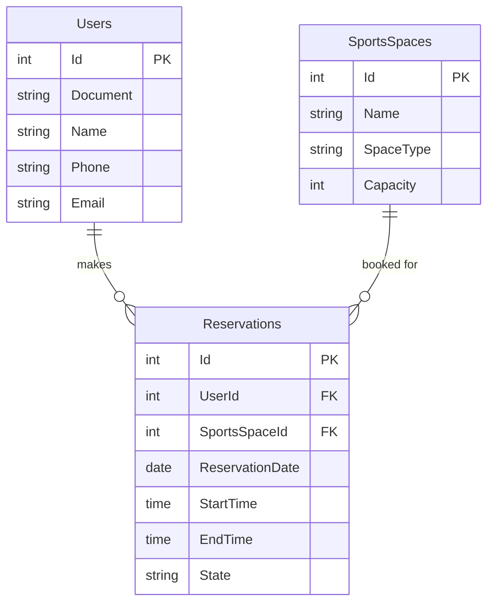
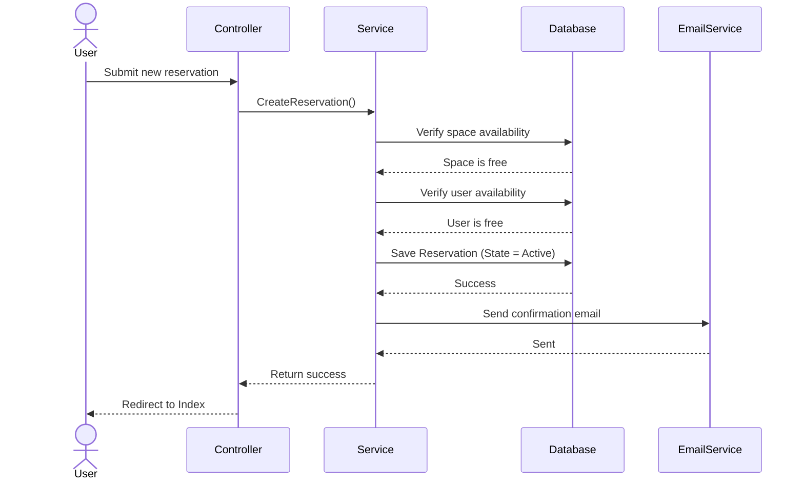

# Sports Complex Management System

This project is a web application developed in ASP.NET Core 8 MVC for the management of a sports complex. It allows administrators to register users, manage sports spaces, and handle reservations while preventing scheduling conflicts.

## Coder Information
* Name: [Carlos Andres Monterrosa Gallego]
* Student ID: [1038809006]
* Course: [C#]

## Features
* User Management: Create, read, and edit user profiles.
* Sports Spaces Management: Create, read, and edit sports facilities (e.g., Soccer, Basketball). Includes search functionality to filter by space type.
* Reservation System: Allows users to book sports spaces. The system includes validation logic to prevent double-booking the same space and prevents a single user from booking multiple spaces at the same time.
* Email Integration: Uses MailKit to send an automated confirmation email when a reservation is successfully created.

## Technologies Used
* ASP.NET Core 8 MVC
* Entity Framework Core
* MySQL
* MailKit for SMTP email services
* HTML, CSS, and Bootstrap

## Diagrams

### Database Entity-Relationship Diagram

### Reservation Logic Flow

## Setup Instructions

1. Clone the repository.
2. Open the `appsettings.json` file and configure your database connection string and your SMTP credentials for the email service:
   - Provide a valid Gmail account and a Google App Password in the `SmtpSettings` section.
   - Provide your MySQL credentials in the `DefaultConnection` string.
3. Build the project using the .NET CLI or Visual Studio.
4. Run the application.
5. Make sure to create at least one User and one Sports Space before attempting to create a reservation.
